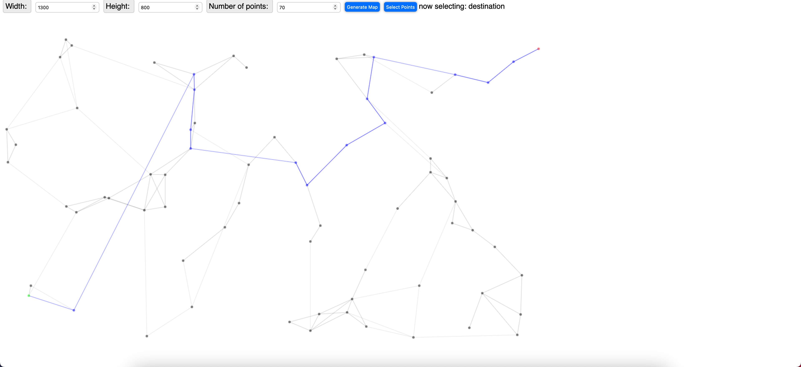

<h1>
    Pathfinder
<h1>



## Description
This is a pathfinding visualizer. The user can select a start and end node. The algorithm will then find the shortest path between the two nodes.

## How to use
1. Select a start node by clicking on a node.
2. Select an end node by clicking on a node.
3. Wait for the algorithm to find the shortest path.

## Install
```sh
    git clone https://github.com/real-kijmoshi/pathfinder.git

    cd pathfinder

    yarn install
```
## Usage
```sh
    vite
```

## License
licensed under the [MIT License](LICENSE).

2023 [@kijmoshi](https://kijmoshi.xyz/)